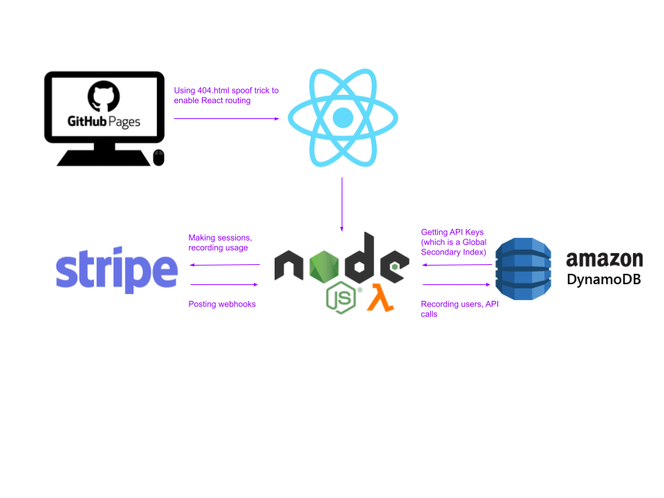

# [Monetized API using Stripe](https://gilaniasher.github.io/monetized-api/)
For a future project, I wanted to figure out how to create a monetized API using Stripe to handle all of the payments. This was also inspired by this [Fireship.io YT Video](https://www.youtube.com/watch?v=MbqSMgMAzxU).

Visit the [GH Pages site](https://gilaniasher.github.io/monetized-api/) to try this out yourself! Stripe is in test mode so it is not actually taking payments.

## How to Use it
- Clicking the `Get Started` button starts a Stripe checkout session which allows a user to give their credit card info to Stripe
- After filling this out, Stripe triggers a webhook which calls my server and stores the user in the DynamoDB database
- The user is redirected back to the GH Pages site where they are shown their API key
- Now the user can [test the API here](https://gilaniasher.github.io/monetized-api/use-api)
- Clicking `Submit API Call` calls the monetized API which just returns a string and reports the usage to Stripe
- Clicking `Get Usage Report` shows the user's current invoice which they will have to pay at the end of the month

## Architecture
This repo consists of a Node serverless backend (AWS Lambda), DynamoDB, and a React frontend hosted on GH Pages. There are instructions in the `api/` and `frontend/` folder for running everything locally.

